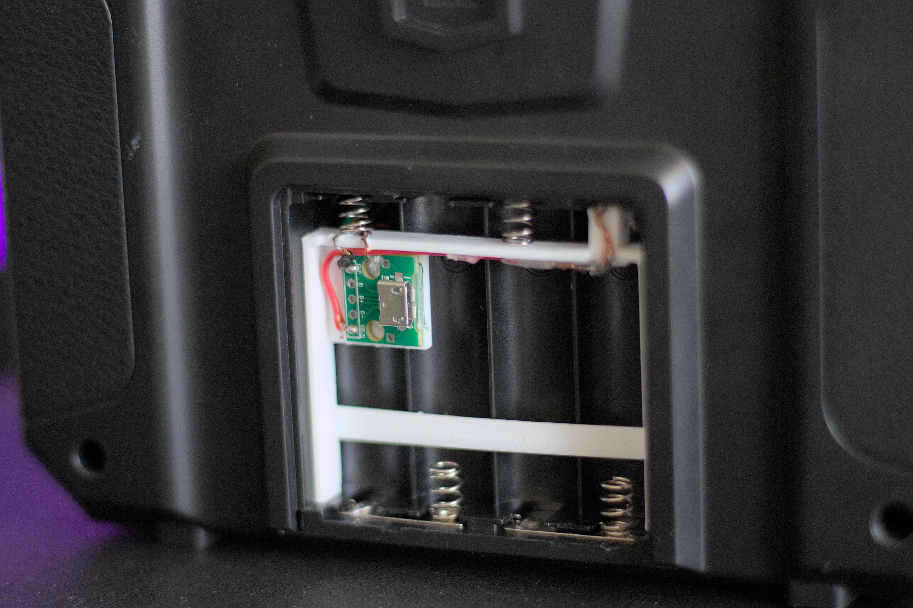
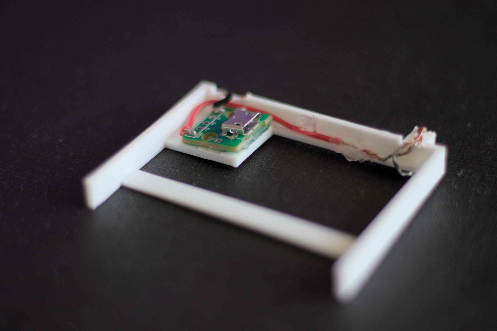

+++
date = '2025-04-19'
draft = false
title = 'Powering A Flysky i6X via USB'
+++

## Intro

Spending money on batteries is not cool, and the Flysky i6X loves draining my cheap batteries. In the following post, I'll be solving a minor inconvenience with some simple "engineering".

## My Solution

Knowing that a AA battery is 1.5V and that the Flysky takes 4 batteries in series. We can deduce that the maximum operating voltage is 6V. Looking at the [manual](https://static1.squarespace.com/static/5bc852d6b9144934c40d499c/t/5d6f66305487dc0001e34939/1567581800555/FS-i6X+User+manual+20160817.pdf), we find that the minimum voltage warning is at less than 4.2V. Meaning, USB's 5V is just at the right spot!

Running a quick test, I cut the end of a USB cable and touched the exposed on ends to the last positive and last negative terminal in the battery compartment. Switching the controller on gave me a healthy and beep and everything seemed in order.

I looked online for any existing solutions, I only found [RCwithAdam's video](https://www.youtube.com/watch?v=Ln6hztrJgnc) where he soldered a USB cable directly to the terminals on the i6X. Being that my controller was new I didn't want to modify it in any way that couldn't be reverted to its original state.

So here is my solution:

### What is it?
It is a 3d printed micro USB adapter that fits perfectly in the battery compartment of the i6X. Best part is the lid is perfectly functional making it very easy to keep safe for travel.

## How did I make it?

### Parts list:

* Female micro USB female breakout board.
* 28 AWG wire, I salvaged mine from the test cable.
* A 3D printer, I have a borrowed 2018 Ender 3 (not the V3 💀).

It took me 3 tries to get the 3d model just right and it takes about 20 minutes to print on the Ender 3. Print with PLA and 100% infill.

- [Freecad file](./3d_files/FlySky_i6x_adapter.FCStd)
- [STL file](./3d_files/FlySky_i6x_adapter.stl)

The added a little solder onto the negative wire and while it still hot I bent it into a U shape. The positive wire is wrapped around the square projection multiple times. Both wires should be melted into the PLA, making sure it is kept into place. 

The trick with the positive projection, is to press it into the battery compartment while the plastic is still soft from melting the wire in. This insures a perfect fit and right amount of contact between the wire and terminal. Try to use as little heat as possible to avoid deformation.




The micro USB breakout board should be super glued into place. I found that hot glue is too weak to take repetitive pushing and pulling.

There is no reason why you can't use a USB type C female breakout board. [Like this one](https://www.amazon.com/Cermant-Connector-Adapter-Socket-Transfer/dp/B0CB395L99/ref=sr_1_8). Additionally, you can use any 5v input as long as it has a micro USB male connector. Get a 1S battery and step it up or 2S and step it down. I have no doubt that it would allow for much longer run time.

## Conclusion

This was a fun "engineering" challenge to solve a minor inconvenience and save some money in the long term. Now I get endless and uninterrupted amount of sim time on my i6X.

Feel free to check out my other [blog posts](v01d.dev/blog) or find the source code to my projects on my [GitHub](https://github.com/V01Ddev).
